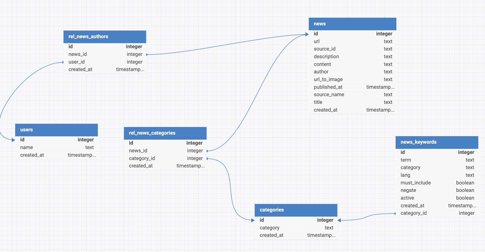

# Documento de Diseño y Justificación Técnica — Prueba Técnica Dentsu

## 1. Visión General del Proyecto
Este proyecto tiene como objetivo diseñar, implementar y documentar una solución de ingeniería de datos que permita la *obtención, procesamiento y almacenamiento* de noticias relacionadas simultáneamente con Inteligencia Artificial y Marketing, utilizando la API pública [News API](https://newsapi.org/).

El proyecto parte de tres pilares fundamentales:

1. Obtención de datos
    * Integración con la API de NewsAPI.
    * Configuración de parámetros dinámicos.
2. Procesamiento y filtrado
    * Limpieza de duplicados y normalización de datos.
    * Almacenamiento de la información en una base de datos.
3. Orquestación del pipeline

La arquitectura propuesta y la implementación permiten:

* Escalar el volumen de datos procesados.
* Mantener un registro estructurado de noticias relevantes.


## 2. Obtención y Procesamiento de Datos

Para la implementación de este proyecto he utilizado **Python** como lenguaje principal, dado que es ampliamente adoptado en el ámbito de la ingeniería de datos y cuenta con un ecosistema de librerías muy sólido para extracción, transformación y carga de información (ETL).

Entre las librerías más relevantes destacan:

* **`requests`**: para la conexión y consumo de la API pública de [NewsAPI](https://newsapi.org/).
* **`Pandas`**: para la limpieza, normalización y estructuración de los datos antes de ser insertados en la base de datos.
* **`SQLAlchemy`**: para la comunicación con la base de datos, garantizando flexibilidad en el manejo de conexiones y compatibilidad con distintos motores.

El proceso seguido ha sido:

**1. Exploración y análisis inicial**

Inicialmente desarrollé un **notebook** que me permitió realizar un análisis exploratorio de lo datos proveniente de la API, permitiendome esta fase aterrizar las primeras limpiezas, conexiones y modelos de datos que posteriormente iba a necesitar en el pipeline final.

**2. Diseño dinámico de la query a NewsAPI**

Para filtrar artículos que contuvieran información relacionada con *Inteligencia Artificial* y *Marketing*, NewsAPI ofrece un sistema de construcción de queries con términos de búsqueda específicos.

Aunque inicialmente valoré la opción de codificar directamente el query string en el código, opté por un enfoque más flexible: **crear una tabla en la base de datos que almacene las *keywords*** y permitir que el código construya la query automáticamente a partir de esos registros.

Este diseño ofrece varias ventajas:

* Posibilidad de gestionar *keywords* en diferentes idiomas.
* Activar o desactivar términos de forma dinámica.
* Añadir nuevas categorías o criterios sin modificar el código.
* Centralizar la lógica de búsqueda en un único punto configurable.

De esta forma, el sistema gana en **flexibilidad** y **escalabilidad**, evitando dependencias innecesarias del código para realizar cambios transaccionales sobre los criterios de búsqueda.

**3. Limpieza y normalización**

Una vez obtenida la respuesta de la API, el código transforma el contenido JSON en un **DataFrame de Pandas**, lo que facilita la manipulación, limpieza y normalización de los datos.

Este proceso se fundamenta en tres pilares:

* **Integridad de datos**: validación de artículos no duplicados. Se decidió utilizar la **URL** como identificador único, al ser más fiable que el título o el autor. Este criterio también se alineó con las columnas de salida requeridas y la información obligatoria que consideré más relevante.

* **Normalización para la ingesta**: conversión de la fecha al formato requerido y cumplimentación del campo `author` en los casos en que venía vacío, con el objetivo de mantener uniformidad y consistencia en el conjunto de datos; así como eliminación de artículos sin URL ya que no podía considerarlo como artículos validos al no tener constancia de ellos.

* **Relevancia de los artículos**: se evaluó la relevancia en función de la longitud del contenido (`content`), estableciendo un umbral de 1000 caracteres como mínimo para que un artículo fuese considerado relevante. Aunque esta métrica no es perfecta, permite filtrar gran parte de contenido poco significativo. En una fase futura, podría implementarse un campo adicional para clasificar la relevancia de forma más precisa mediante técnicas de procesamiento de lenguaje natural, haciendo webscrapping y accediendo a los artículos en sí.

**4. Automatización de la ingesta**

Para el desarrollo del pipeline, inicialmente implementé un **servicio en Flask** con varios endpoints:

* **Preview de datos**: consulta a la API y muestra un ejemplo de la información recibida.
* **Ingesta completa**: ejecuta el flujo completo de extracción, transformación y carga en la base de datos.
* **Consulta de base de datos**: muestra la información almacenada tras la ingesta.

Opté por este enfoque porque consideré que era una forma ágil de exponer la funcionalidad y facilitar las pruebas, en lugar de depender únicamente de ejecuciones programadas por *batch*. Flask me permitió encapsular y ejecutar los scripts o flujos de forma más controlada y accesible durante la etapa de desarrollo.

Para la ejecución periódica del flujo principal, utilicé la librería **APScheduler**, integrada en el servicio Flask, que permite programar la ingesta de forma automática cada día o, en modo de pruebas, cada 30 segundos mediante la activación de un flag en el entorno.

Este enfoque resultó especialmente útil en desarrollo, ya que me permitió **testear la automatización** de forma local antes de integrar la orquestación definitiva en un sistema como Apache Airflow.

**5. Almacenamiento y Modelo de Datos**

La prueba técnica indicaba la obligatoriedad de ingestar la información recibida y procesada en una base de datos de cualquier tipo. En mi caso he tomado la decisión de utilizar una base de datos de tipo **relacional**, concretamente **PostgreSQL**, alojada en **Supabase**, un servicio gratuito que permite la creación y administración de bases de datos con conectividad sencilla desde entornos de desarrollo.

Esta decisión viene determinada por un pensamiento de **escalabilidad a futuro**.  
Si bien para el caso principal que nos ocupaba podría haber utilizado una base de datos **no relacional** como *MongoDB* (con dos colecciones: una para las *keywords* y otra para las noticias), consideré que este planteamiento podría quedarse corto al requerir en el futuro funcionalidades más complejas, como por ejemplo:

- Clasificación de noticias por categorías únicas.
- Asociación de noticias con múltiples categorías.
- Gestión de autores como entidades independientes.
- Posibilidad de almacenar información adicional que se relacione con varias tablas.

En un flujo posterior, estas mejoras podrían aprovechar **relaciones entre tablas** para vincular datos de forma eficiente y consistente.

### Ejemplo de modelo relacional




## 3. Diseño de Pipeline y Orquestación

El pipeline diseñado sigue un flujo que va desde la **extracción de datos** de la API pública, pasando por la **limpieza y normalización**, hasta su **almacenamiento** en una base de datos relacional.

Para la orquestación he optado por **Apache Airflow**, ya que permite definir y programar pipelines de datos en Python con una interfaz gráfica para su monitorización y control.

En este caso, el *DAG* de Airflow no reimplementa la lógica del pipeline, sino que **invoca directamente la función `process_ingestion` del servicio Flask**, reutilizando así el mismo código que se emplea para las ejecuciones manuales o en modo de desarrollo.

Este enfoque ofrece varias ventajas:

* **Reutilización de código**: la lógica de extracción, transformación y carga se mantiene centralizada en Flask.
* **Desacoplamiento**: Airflow se encarga únicamente de la programación, ejecución y monitorización.
* **Escalabilidad**: la misma función puede ser utilizada desde otros orquestadores o integraciones futuras sin modificar la lógica principal.

Actualmente el pipeline está configurado para que se ejecute automaticamente cada día a las 07:00, cumpliendo así el requisito de consulta e ingesta periódica.

### Uso de Docker para la orquestación

Para soportar este orquestador he utilizado un **entorno Dockerizado**, con contenedores independientes para cada servicio.

Este enfoque ofrece varias ventajas:

* **Entorno replicable**: el mismo entorno utilizado en desarrollo puede desplegarse en producción sin modificaciones.
* **Aislamiento y escalabilidad**: cada servicio corre de forma independiente, lo que permite monitorizar su estado y escalarlo de manera individual si es necesario.
* **Facilidad de despliegue**: levantar el orquestador en desarrollo o en pruebas es tan sencillo como ejecutar un único comando, asegurando entornos consistentes y similares a producción.

### Justificación de la elección frente a otras opciones

He considerado el uso de **Apache Airflow** como opción más escalable a futuro y que permitiría orquestar pipelines de manera más avanzada si el proyecto lo requiriera, si bien podría haber utilizado otras opciónes más sencillas como **GitHub Actions** o **Azure DevOps Pipelines** he considera que Airflow era la mejor opción.

### Diagrama de flujo del pipeline

```mermaid
flowchart TD
    A[Inicio DAG en Airflow] --> B[Invocar función process_ingestion de Flask]
    B --> C[Extracción de datos desde NewsAPI]
    C --> D[Limpieza y normalización con Pandas]
    D --> E[Validación de duplicados y relevancia]
    E --> F[Almacenamiento en PostgreSQL (Supabase)]
    F --> G[Generar logs de ejecución con logging de Python]
    G --> H[Visualización de logs en Airflow]
    H --> I[Fin del Pipeline]
```

### Sistema de logging y alertas

Actualmente, el sistema incorpora un mecanismo de logging implementado con la librería estándar `logging` de Python.
Este sistema genera registros de eventos durante las distintas fases de ejecución del pipeline, los cuales pueden consultarse en tiempo real desde la sección de logs durante la ejecución del flujo.

Si bien por el momento los registros se almacenan únicamente en memoria y en la salida estándar, sería posible ampliar esta funcionalidad para persistirlos en una tabla de la base de datos, asociando cada registro a un identificador único por ejecución, lo que permitiría su trazabilidad y análisis posterior.

A lo que respecta a las alertas, Airflow cuenta con implementaciones para poder notificar a los usuarios o a un correo especifico el estado del pipeline actualmente no está implementado pero se podría realizar de cara a que una vez el pipeline ha finalizado notifique por correo electronico el `success` y si ha fallado el `failure` esto se desarrollaría a través del `EmailOperator` de Airflow

## 4. Despliegue y arquitectura

Por familiaridad, la solución se desplegaría en Microsoft Azure.

Al tener empaquetada en Docker la ejecución de Apache Airflow, se podría desplegar en Azure Kubernetes Service (AKS) o en el servicio de contenedores de Azure, utilizando Azure Container Registry para almacenar las imágenes. El metastore de Airflow estaría alojado en Azure Database for PostgreSQL, y se podría implementar un flujo de CI/CD en Azure Pipelines para actualizar tanto el código de los DAGs como el esquema de la base de datos de forma automatizada.

El sistema de gestión de secretos sería Azure Key Vault, por lo que sería necesario adaptar la configuración de Airflow para obtener desde allí las claves y credenciales necesarias para la ejecución del DAG.